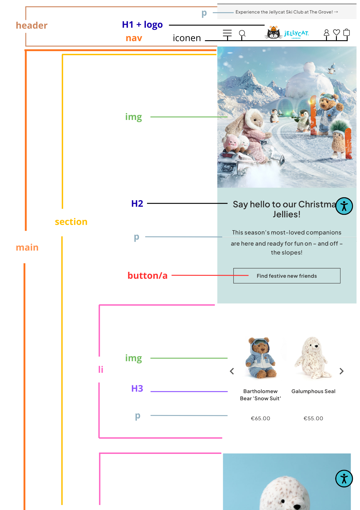
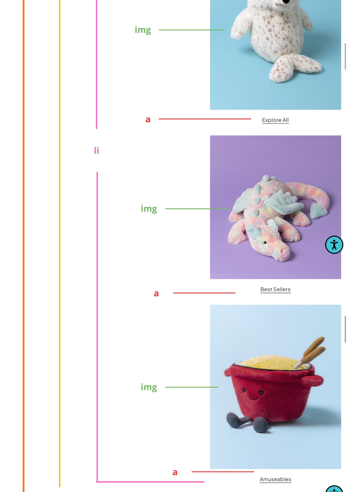
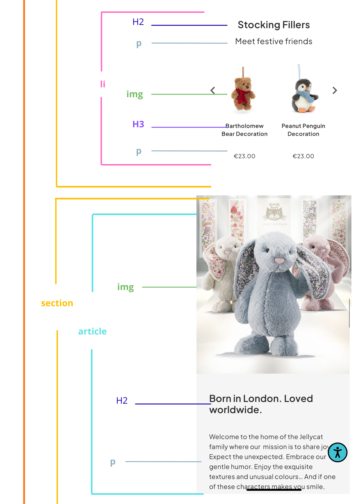
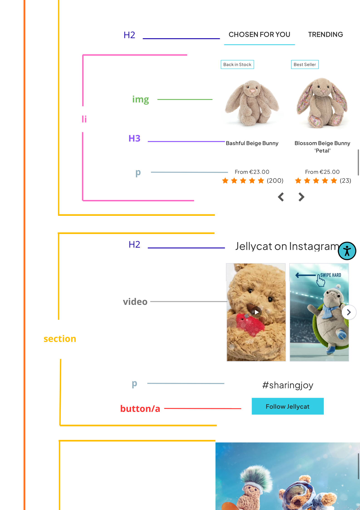
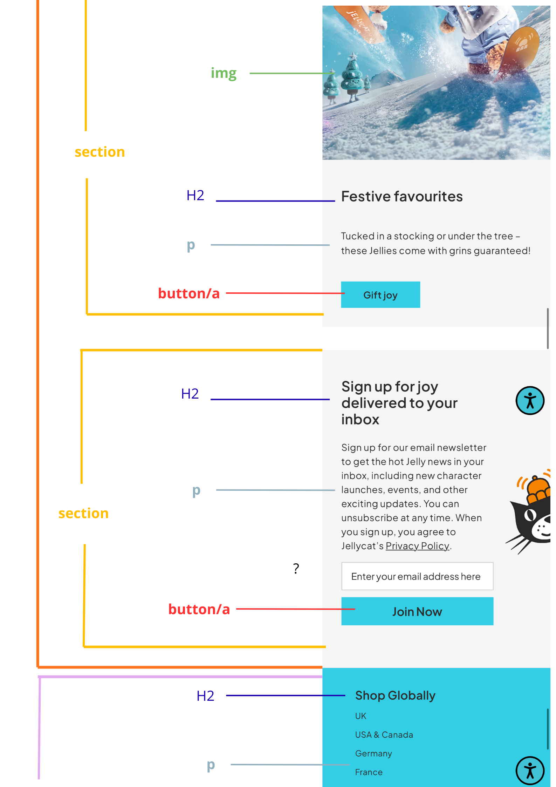
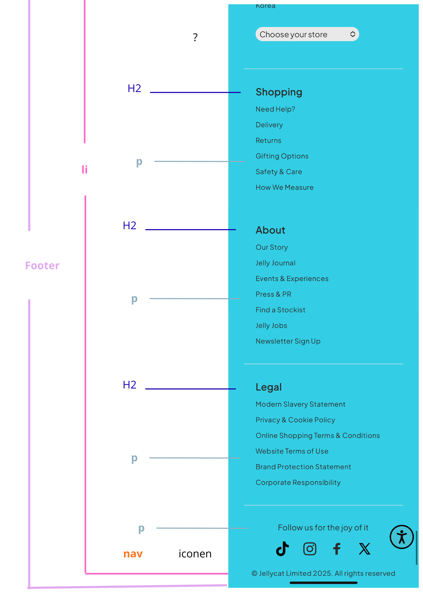
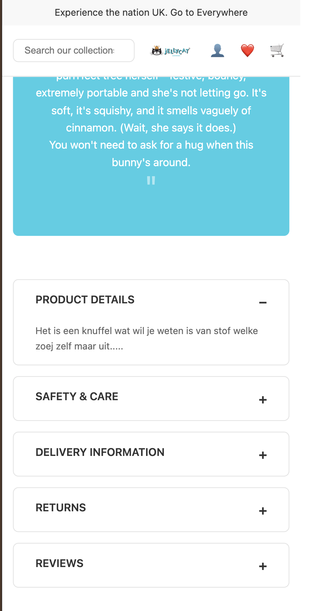
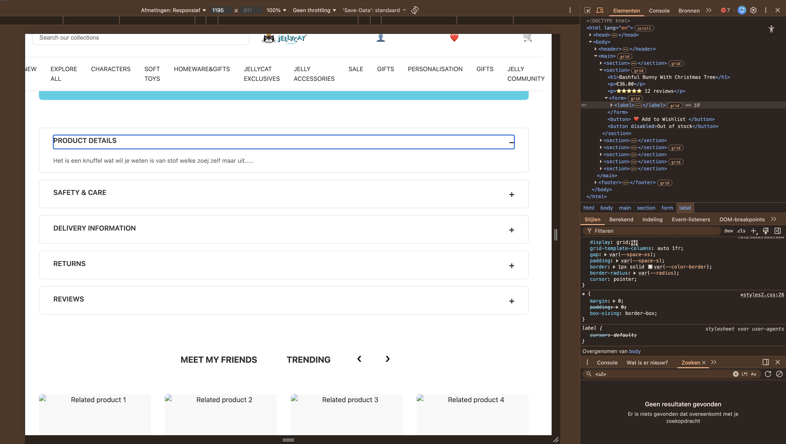
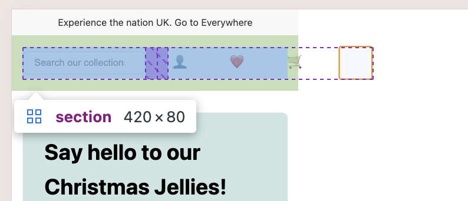

# Procesverslag
Markdown is een simpele manier om HTML te schrijven.  
Markdown cheat cheet: [Hulp bij het schrijven van Markdown](https://github.com/adam-p/markdown-here/wiki/Markdown-Cheatsheet).

Nb. De standaardstructuur en de spartaanse opmaak van de README.md zijn helemaal prima. Het gaat om de inhoud van je procesverslag. Besteedt de tijd voor pracht en praal aan je website.

Nb. Door *open* toe te voegen aan een *details* element kun je deze standaard open zetten. Fijn om dat steeds voor de relevante stuk(ken) te doen.

## Jij

  
uitwerken voor kick-off werkgroep

  ### Auteur:
  Ana Broos

  #### Je startniveau:
  Blauw, geen ervaring met coderen.
  
  #### Mijn verwachtingen
  Ik nieuw met al deze codes, maar wil stap voor stap beter worden met HTML, CSS en JS.

  #### Je focus:
  responsive Ik kies voor **helemaal responsive**.  
Dat betekent dat ik mijn website goed wil laten werken van kleine telefoons tot grote schermen.
 

## Je website

  
uitwerken voor kick-off werkgroep

  ### Je opdracht:
Ik ga twee pagina’s van de **Jellycat** website namaken.  
**Originele website:** [https://www.jellycat.com](https://www.jellycat.com)

Ik kies voor:  
1. **Homepage** – met hero, categorieën en promobanners in een kerstthema.  
2. **Productpagina Bashful Bunny with Christmas Tree** – met foto, prijs, beschrijving en Call To Action knop.  

De Jellycat-website is vriendelijk en rustig, met veel witruimte en een duidelijke structuur.  
Ik kan hiermee goed oefenen met responsive design, semantische HTML en een kleine micro-interactie.

  #### Screenshot(s) van de eerste pagina (small screen): 
  Homepage  

  #### Screenshot(s) van de tweede pagina (small screen):
  Bashful Bunny with Christmas Tree  
 
 

## Toegankelijkheidstest 1/2 (week 1)

  
uitwerken na test in 2e werkgroep

De toegankelijkheidstest is uitgevoerd op de homepage van Jellycat (jellycat.com) op 13 november 2025. De test is uitgevoerd in Google Chrome op desktop en mobiel op safari, waarbij de WCAG-checklist als leidraad is gebruikt.

  ### Bevindingen homepage
  Tijdens het testen van de toegankelijkheid van de **Jellycat-homepage** kwamen de volgende punten naar voren:

  #### Positieve punten
  - De homepage bevat duidelijke afbeeldingen en overzichtelijke navigatie.
  - De website werkt goed op verschillende schermformaten (desktop, tablet, mobiel).
  - De meeste tekst heeft voldoende kleurcontrast en is goed leesbaar.
  - De focusvolgorde is grotendeels logisch opgebouwd.
  - Er is geen automatisch geluid of video aanwezig, wat rustiger is voor gebruikers.

  #### Verbeterpunten
  - De focus styling (kleuren die aangeven waar je bent) is soms zwak, waardoor toetsenbordnavigatie (met tab door een website) minder duidelijk is.
  - Er is geen skip to content-link aanwezig.
  - Sommige banners of afbeeldingen hebben ontbrekende of onduidelijke alt-teksten.
  - De headingstructuur wijkt af van WCAG-richtlijnen (niveaus worden soms overgeslagen).
  - Kleine elementen zoals iconen hebben soms te weinig contrast.
  - Er wordt geen ondersteuning geboden voor dark mode of high-contrast weergave.
  - De animaties/carrousels kunnen niet worden gepauzeerd en reageren niet op prefers reduced motion.

#### Mobiel
  - Geen horizontale scroll (goed).
  - Alle hero-banners passen goed op mobiel.
  - Het menu is makkelijk te bedienen.
  - Sommige kleine elementen blijven lastig aan te tikken met een duim (wishlist, filters).

  #### Media
  - Geen video’s of audio aanwezig dus niet van toepassing.

  ### Samenvatting
   De homepage van Jellycat is visueel aantrekkelijk en grotendeels functioneel, maar mist een aantal belangrijke WCAG-richtlijnen. Vooral de focus-weergave, headingstructuur, alt-teksten en animatie-instellingen kunnen verbeterd worden.  
   Over het algemeen is de pagina redelijk toegankelijk, maar niet volledig WCAG-conform.

### Bevindingen productpagina
  De toegankelijkheidstest is ook uitgevoerd op de productpagina "Bashful Bunny with Christmas Tree" op 13 november 2025.  
  De test is uitgevoerd in Google Chrome op desktop en op safari op mobiel, met behulp van de WCAG-checklist.
  Tijdens het testen van de toegankelijkheid van de **Jellycat-productpagina** (https://eu.jellycat.com/bashful-bunny-with-christmas-tree/) wamen de volgende punten naar voren:

  #### Positieve punten
  - De productpagina heeft duidelijke afbeeldingen van hoge kwaliteit.
  - Veel afbeeldingen bevatten alt-teksten die beschrijvend genoeg zijn voor screenreaders.
  - De pagina is overzichtelijk opgebouwd met een duidelijke producttitel (h1) bovenaan.
  - De pagina werkt goed responsive op verschillende schermformaten, inclusief mobiel.
  - De tekst is over het algemeen goed leesbaar door voldoende kleurcontrast.
  - Belangrijke knoppen (zoals "Add to Bag") zijn goed zichtbaar en makkelijk te vinden.

  #### Verbeterpunten
  - De focus styling  (kleuren die aangeven waar je bent) is niet overal even duidelijk, waardoor toetsenbordnavigatie (met tab door een website) soms lastig zichtbaar is.
  - Er is geen skip to content link aanwezig op de pagina zoals op de hoofdpagina.
  - Niet alle iconen (bijv. wishlist hartje) hebben een correcte of duidelijke alt-tekst.
  - De headingstructuur kan beter: sommige visuele koppen zijn geen echte HTML-headings.
  - Kleine iconen hebben soms te weinig contrast op een lichte achtergrond.
  - De site ondersteunt geen dark mode of high-contrast instellingen.
  - Animaties reageren niet op prefers reduced motion en kunnen niet worden gepauzeerd.
  - Sommige interactieve elementen zijn te klein op mobiel, waardoor mis-taps kunnen ontstaan.

  #### Mobiel
  - De pagina schaalt goed mee op mobiel.
  - Er is geen horizontale scroll (goed).
  - Productfoto’s en knoppen zijn goed zichtbaar.
  - Kleine iconen zoals wishlist blijven moeilijk te raken met een duim.

  #### Media
  - Er zijn geen video's of audio op deze pagina, dus dit onderdeel is niet van toepassing.

  ### Samenvatting
  De productpagina van Jellycat is visueel duidelijk en redelijk toegankelijk, maar voldoet nog niet aan alle WCAG-richtlijnen.  
  Vooral de focus-styling, alt-teksten, headingstructuur en ondersteuning voor toegankelijkheidsvoorkeuren kunnen verbeterd worden.  
  Over het algemeen is de pagina toegankelijk voor de meeste gebruikers, maar nog niet volledig WCAG-conform.

## Breakdownschets (week 1)

  
uitwerken na afloop 3e werkgroep

  ### de hele pagina: 
  
 
  
 
  
 
  
 
  
 
  

  ### dynamisch deel (bijv menu): 
  moet nog
  

  ### wellicht nog een dynamisch deel (bijv filter): 
  moet nog
  

## Voortgang 1 (week 2)

  
uitwerken voor 1e voortgang

  ### Stand van zaken
  **Week 2 – Werkgroep 3, 4 & 5**

#### Werkgroep 3 – **CSS Grid & Media Queries**

Tijdens de derde werkgroep heb ik geleerd hoe ik CSS Grid kan gebruiken om layouts te maken die flexibel en overzichtelijk zijn. Ik weet nu hoe ik rijen en kolommen definieer, hoe ik grid gebruik en hoe je elementen op het grid positioneert. Ook heb ik kennisgemaakt met media queries, waarmee ik layouts kan aanpassen aan verschillende schermformaten zoals mobiel, tablet en desktop responsive kan maken. 

Hiermee kan ik oefenen om alles in een grid box te krijgen en vorm te geven
## hoe werkt het##
 **grid-column-start:** bepaald welke startpositie binnen grid kolommen |
 zo doe je het
 display: grid;
  grid-template-columns: 8;
  grid-template-rows: 8;

  grid-column-start: span 3;
  grid-column-end: 6;

 Maar je kan het verbreden over meerdere columns door de **grid-column-end-property** toe te voegen.
 ls je gridlijnen vanaf rechts in plaats van links wilt tellen, kan je grid-column-start en grid-column-end negatieve waardes geven. Je kan hem bijvoorbeelds op **-1 zetten** om de eerste gridlijn vanaf rechts aan te spreken.
 In plaats van een grid item te definiëren op basis van de start- en eindposities van de gridlijnen, kan je hem definiëren op basis van het aantal kolommen dat je wilt invullen, door het **span**-sleutelwoord te gebruiken. Onthoud dat *span alleen werkt met positieve waardes*.
  **grid-column: 2 / 4;** laat het griditem starten op de 2e verticale gridlijn en eindigen op de 4e gridlijn. werkt ook met span

 **grid-template-rows:** bepaald welke startpositie binnen grid rijen -

**Dit heb ik geoefend met: Gird garden.**

#### Werkgroep 4 – **Flexbox**
In de vierde werkgroep heb ik gewerkt met Flexbox. Ik heb geleerd hoe je elementen horizontaal en verticaal kunt uitlijnen, hoe je ruimte verdeelt en hoe je flex-direction, justify-content en align-items gebruikt. Flexbox helpt vooral bij het bouwen van kleinere componenten en responsive onderdelen binnen een pagina.

Hierbij kan je een sleep menu maken voor verschillende jallycats

 **Hierbij heb ik vooral gebuik gemaakt van :Flexbox Froggy**

#### Werkgroep 5 – **JavaScript 3-stap**

Deze les heb ik helaas gemist en ga ik mij nog later in verdiepen

### algemeen
Bij de breakdownsheet heb ik geleerd dan section en article
bij 

  ### Agenda voor meeting
  samen met je groepje opstellen -   *Dit hebben wij als groepje niet voorbereid.*
  
  - Zelf wil ik kijken naar mijn breakdownsheet of dit een beetje klopt, zodat ik doorkan naar verwerken in html bestand.
  - kloppen de afkortingen? Wat is de section en wat de article heb ik het andersom?
  - Met de tijd red ik het nog?

  ### Verslag van meeting
  hier na afloop snel de uitkomsten van de meeting vastleggen (vr 21 nov 2025)

  - Bij heading moet je een section gebruiken
  - Als je # doen bij een link dan springt hij naar de home pagina
  - LI aanpassen naar UL
  - ul daar hoort een list in -  html ul opzoeken voor voorbeeld
  - ? is een input dit kan ik bijwerken

## Voortgang 2 (week 3)

  
uitwerken voor 2e voortgang

  ### Stand van zaken
Dit is mijn kennis en hoe ik het heb toegepast

### HTML-structuur
- De pagina is opgebouwd met **semantische HTML5-tags** zoals `<header>`, `<nav>`, `<main>`, `<section>` en `<article>`, omdat dit zorgt voor een duidelijke en toegankelijke structuur.
- Ik heb **geen classes of ID’s** gebruikt, zoals de opdracht voorschrijft. Alle styling gebeurt via elementselectoren en `nth-of-type()`.
- Voor navigatie, producten, categorieën, Instagram en socialmedia-iconen gebruik ik **<ul>** en **<li>**. Dit maakt herhalende content overzichtelijk en logisch.
- Elke sectie heeft een vaste volgorde: een **titel**, daarna **beschrijvende tekst**, gevolgd door **de inhoud**.

### CSS-keuzes
- De website is gemaakt met een **mobile-first aanpak**, zodat de pagina eerst goed werkt op kleine schermen.
- Ik gebruik **CSS Grid** als belangrijkste layout-systeem. Dit zorgt voor flexibele en overzichtelijke grids voor o.a. de header, hero-sectie, productblokken en footer.
- In `:root` heb ik **CSS-variabelen** aangemaakt voor kleuren, spacing, typografie en border-radius. Hierdoor blijft het ontwerp consistent en makkelijk aan te passen.

### Responsief ontwerp
- Er is **één breakpoint op 60em (960px)** om over te schakelen naar de desktoplayout.
- Op desktop:
  - De header wordt een **3-koloms grid** en het volledige menu wordt zichtbaar.
  - De hero, Born in London-sectie en de promotiebanner veranderen in **twee kolommen**.
  - Productoverzichten bestaan uit **meerdere kolommen (3–5)**.
  - De footer wordt een **4-koloms layout**.
  - Het nieuwsbrief-formulier wordt naast elkaar geplaatst.

### Technische keuzes
- Ik maak gebruik van **`nth-of-type()`** en **`nth-child()`** om onderdelen te selecteren zonder classes.
- Afbeeldingen hebben **beschrijvende alt-teksten** voor toegankelijkheid.
- De kleuren zijn afgestemd op de Jellycat-stijl van de referentie.
- Ik gebruik **rem**-eenheden zodat de tekst en layout meeschalen met de instellingen van de gebruiker.

### Toegankelijkheid
- De semantische HTML-structuur maakt de website beter leesbaar voor screenreaders.
- Icon-knoppen hebben ARIA-labels zodat de functie duidelijk is.
- Teksten en layout schalen mee als een gebruiker zijn browserinstellingen aanpast.
- Formulieren en navigatie zijn volledig te bedienen met het toetsenbord.

  ### Agenda voor meeting
  samen met je groepje opstellen

  | student 1      | student 2          | student 3    | student 4        |
  | ---            | ---                | ---          | ---              |
  | dit bespreken  | en dit             | en ik dit    | en dan ik dat    |
  | en dat ook nog | dit als er tijd is | nog een punt | dit wil ik zeker |
  | ...            | ...                | ...          | ...              |

  ### Verslag van meeting
  hier na afloop snel de uitkomsten van de meeting vastleggen

  - punt 1
  - punt 2
  - nog een punt
- ...

## Toegankelijkheidstest 2/2 (week 4)

  
uitwerken na test in 9e werkgroep

  ### Bevindingen
  Moet ik nog doen

## Voortgang 3 (week 4)

  
uitwerken voor 3e voortgang

  ### Stand van zaken
  - De header en footer kreeg ik niet gelijk op beiden pagina's
  - Ik wilde van 2 Css paginas naar 1

  ### Verslag van meeting
  
  - de header en footer op beiden paginas het zelfde maken

## Eindgesprek (week 5)

  
uitwerken voor eindgesprek

  ### Je uitkomst - karakteristiek screenshots:
   Hieronder laat ik screenshots zien van onderdelen waar ik het meest trots op ben.  
  Vooral de grid-layouts, de productpagina en het responsive gedrag laten goed zien wat ik deze weken heb geleerd.
  
 

  ### Dit ging goed/Heb ik geleerd: 
 In deze weken heb ik vooral geleerd hoe ik **HTML en CSS veel netter en logischer kan opbouwen**.  
  Ik heb echt ontdekt hoe krachtig **CSS Grid** is, en hoe je met alleen `nth-child` selectors en semantische HTML een hele site kunt opzetten zonder classes.

  Wat ik goed vond gaan:
  - Ik snap hoe je **grid-template-columns** slim inzet voor verschillende layouts (van 1 kolom naar 4–6 kolommen).  
  - Ik heb geleerd hoe ik **details/summary** kan gebruiken voor uitklapbare blokken zonder JavaScript.  
  - Ik kan pagina's **opnieuw opbouwen in dezelfde stijl als een bestaande website** (Jellycat) met alleen HTML/CSS.  
  - Ik heb geleerd om **variabelen in :root** te gebruiken voor consistentie.  
  - Ik ben zekerder geworden in het ontleden van een layout en deze precies namaken.

  
  

  ### Dit was lastig/Is niet gelukt:
 Niet alles ging in één keer goed. Ik liep vooral vast bij wat complexere onderdelen:

  Wat ik lastig vond:
  - De productpagina had veel kleine details, zoals pijltjes die **absoluut gepositioneerd** moesten worden over een afbeelding.  
  - Omdat ik **geen classes** mocht gebruiken, moest ik slim omgaan met `nth-child`, wat best verwarrend werd in lange pagina’s.  
  - Soms werkte een `grid-template` anders dan ik dacht, en moest ik veel testen tot het klopte.  
  - De responsive layout van sommige sections (vooral Instagram en promo-banners) kostte tijd om netjes te krijgen.

  Wat uiteindelijk niet helemaal gelukt is zoals het voorbeeld:
  - Een paar responsive overgangen voelen nog een beetje abrupt.  
  - Sommige stukken HTML had ik achteraf graag anders gestructureerd, maar dat kwam ik pas later achter.
  - er had meer in Flex kunnen staan ipv Grid

  
  

## Bronnenlijst

  
continu bijhouden terwijl je werkt

  Nb. Wees specifiek ('css-tricks' als bron is bijv. niet specifiek genoeg). 
  Nb. ChatGpT en andere AI horen er ook bij.
  Nb. Vermeld de bronnen ook in je code.

  1. **Home page van Jellycat**: De homepage waar ik de toegangkelijkheidstest op heb gedaan https://eu.jellycat.com/ (*13 november 2025*)
  2. **Product pagina**: De productpagina waar ik de toegangkelijkheidstest op heb gedaan https://eu.jellycat.com/bashful-bunny-with-christmas-tree/ (*13 november 2025*)
  3. **Chat GPT**: Om te vragen hoe je in de read me woorden bold en cursief maakt en hoe je de koppen groter kunt maken https://chatgpt.com/ (*13 november 2025*)
  4. **geeksforgeeks** Voor vragen over flex https://www.geeksforgeeks.org/css/5.  
  5. **valideren sistematisch gemaakt**  what-is-the-difference-between-inline-flex-and-inline-block-in-css/
  https://validator.w3.org/ (vanaf week 3)
  6. **CSS w3schools** om heel veel css tags op te zoeken  https://www.w3schools.com/html/default.asp
  7. **CSS w3schools** Om html codes op te zoeken  
  8. **studentbegeleiders Maja en David** Voor alle vragen als de code niet werkte en uitleg over margin, paddig, grid, flex, en de breakdownsheats (tijdens voorgangs gesprek) voor een duidelijk steructuur om an de website te beginnen  
  9. **Docent Vasilis van Gemert** Voor vragen of mijn code voldoet aan de voorwaarden en voor vragen bij het vast lopen of foutmeldingen in de code. 
  10. **youtube** uileg hoe je een nieuwe pagina maakt en linkt https://www.youtube.com/watch?v=vzZ7TXGIQ3Y
     uitleg over flex overzicht https://www.youtube.com/shorts/tpBzHfq_Z2o 
  11. **Ronald en Ali** hebben geholpen met uitleg javascript omdat ik de les had gemist, uitleg hoe je van 2 css naar 1 ging en met foutmeldingen die ik over het hoofd zag
     

